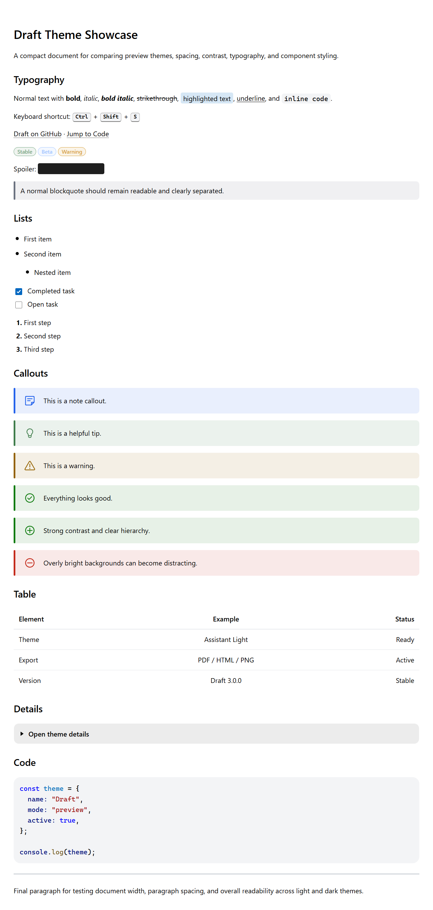
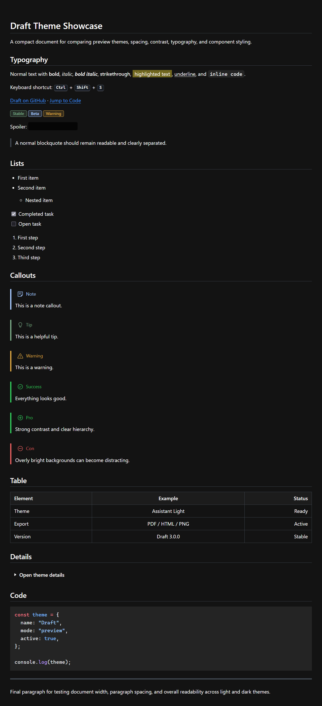

# Theme Gallery

Quick preview of the available preview themes.

---

## Draft Dark
The default Draft preview theme with a calm dark workspace style.  

---

## Assistant Dark 
A dark theme inspired by modern assistant-style response layouts.  

---

## Assistant Light 
A light theme inspired by modern assistant-style response layouts.

---

## Repository Dark 
A GitHub-inspired Markdown theme for a familiar repository-style reading experience.  

---

## The Hub
A dark orange-accent theme inspired by a website everyone definitely opens for research purposes.  

