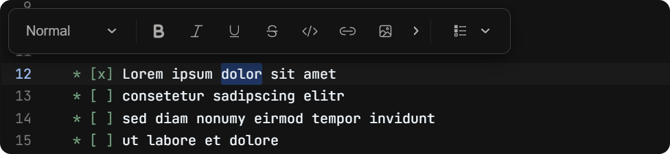
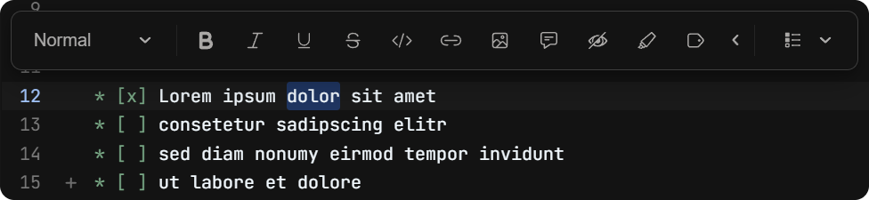
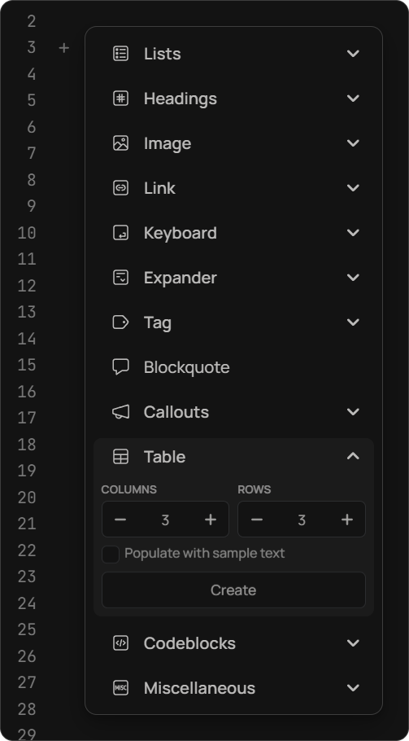

# Draft

Draft is a focused Windows Markdown editor with live preview, save snapshots, a floating formatting toolbar, and a calm desktop workspace.

Current version: `3.0.0` · [Download](https://github.com/mefabc24/Draft/releases/latest) · [Themes](Documentation/User/THEMES.md) · [Shortcuts](Documentation/User/SHORTCUTS.md) · [Report issue](https://github.com/mefabc24/Draft/issues) · [Roadmap](Documentation/User/ROADMAP.md)


## For Users

### What Draft Is

Draft gives you a local Markdown workspace with three modes:

- **Editor** for distraction-light writing.
- **Split** for writing and previewing side by side.
- **Preview** for reading the rendered document.

It works with normal Markdown and text files on your Windows machine. Your files
stay local unless you choose to put them somewhere else.

### Download and Install

Get the latest Windows release from:

https://github.com/mefabc24/Draft/releases/latest

Release downloads normally include:

- `Draft-Setup-v<version>.exe` for the installed app.
- `mefabc24.Draft-win-Portable.zip` for the portable app.

Automatic update checks are available in installed Draft releases. Portable or
development builds may show that updates are not available.

### Highlights

- Three workspace modes: **Editor**, **Split**, and **Preview** for writing, editing, and reading Markdown.
- Live Markdown preview with support for GitHub-flavored Markdown, tables, task lists, raw HTML, highlighted code blocks, and in-document heading links.
- Draft-flavored Markdown extensions for callouts, badges, tags, spoilers, highlights, underlines, keyboard keys, comments, and collapsible details.
- Theme-aware document export to HTML, PDF, and PNG.
- Five preview themes: Draft Dark, Assistant Dark, Assistant Light, Repository Dark, and The Hub.
- Floating Markdown Toolbar for quickly formatting content in both the editor and the rendered preview.
- Preview editing support for editing the Markdown source behind selected rendered content.
- Quick Insert Menu for adding common Markdown elements and Draft extensions without remembering their syntax.
- Flexible scroll sync options, including two-way sync, editor-to-preview sync, preview-to-editor sync, and follow-edited-section behavior.
- Configurable keyboard shortcuts and Status Bar items.
- Save As support and recovery options when a document's original location no longer exists.
- Save Snapshot System with separate restore points for the last manual save and the latest autosave.

### Feature Preview

#### Floating Markdown Toolbar

Quickly format Markdown in both the editor and the rendered preview. The toolbar stays compact by default and can be expanded to show additional formatting options.

**Collapsed**



**Expanded**



#### Quick Insert Menu

Insert common Markdown blocks without remembering the exact syntax.



#### Save Snapshots

Restore either the last manual save or the latest autosave.


### Saving and Recovery

Draft supports manual save, autosave, and optional save-on-focus-lost behavior.

For each file, Draft keeps separate restore points for:

- The last manual save.
- The latest autosave.

This means you can recover recent work without overwriting the intentional save
point you created manually.

### Settings

Draft includes settings for:

- Startup behavior, update checks, autosave, save-on-focus-lost, and close
  confirmations.
- Editor typography, layout, Markdown syntax highlighting, whitespace display,
  indentation, cursor style, and pairing behavior.
- Preview theme and external-link confirmation.
- Floating Markdown Toolbar availability and customizable Status Bar items.
- Default save location and optional `.txt` file association.
- Interface language selection. English is currently the available language.
- A shortcuts page for recording, resetting, and checking custom keyboard shortcuts for conflicts.
- Version and update controls.

## For Developers

### Architecture

Draft is a Windows desktop app with a native WPF shell and a React workspace
embedded through WebView2.

- `Draft.Wpf` handles the desktop window, startup flow, local files, settings,
  autosave, snapshots, update checks, packaging hooks, and Windows integration.
- `Draft.Web` handles the Monaco editor, Markdown preview, preview themes,
  Floating Markdown Toolbar, Quick Insert Menu, and editor-facing interactions.

### Tech Stack

- WPF on `net10.0-windows`
- WebView2
- Velopack
- React 19
- TypeScript 6
- Vite 8
- Monaco Editor
- `react-markdown` with `remark-gfm`
- `rehype-raw` for Markdown HTML support
- `rehype-pretty-code` for highlighted code previews

### Repository Structure

```text
Draft.Web/        React, TypeScript, Vite, Monaco, preview, toolbar, themes
Draft.Wpf/        WPF desktop host, WebView2 shell, settings, saves, packaging
Documentation/    User and developer documentation
Scripts/          Automation scripts for versioning and release packaging
Licenses/         Third-party license files
Releases/         Generated Velopack release artifacts
```

`Releases/` is generated output and should not be committed.

### Prerequisites

Install these tools before building the app:

```text
Windows
.NET SDK with net10.0-windows support
Node.js and npm
WebView2 Runtime
Velopack CLI, only needed for creating releases
```

### Development

Install web dependencies:

```powershell
cd Draft.Web
npm install
```

Run the web workspace in Vite development mode:

```powershell
npm run dev
```

Build the web workspace:

```powershell
npm run build
```

Build the Windows desktop app from the repository root:

```powershell
dotnet build Draft.Wpf/Draft.slnx
```

Run the Windows desktop app:

```powershell
dotnet run --project Draft.Wpf/Draft.csproj
```

For desktop builds and releases, build `Draft.Web` first. `Draft.Wpf` includes
the generated `Draft.Web/dist` files in its output and publish artifacts.

### Useful Commands

```powershell
# Web checks
cd Draft.Web
npm run lint
npm run build

# Desktop build
cd ..
dotnet build Draft.Wpf/Draft.slnx

# Update version fields (example)
.\Scripts\update-version.ps1 -Version 3.0.0

# Create a Windows release
.\Scripts\create-release.ps1
```

### Releasing

Version fields and release steps are documented in:

```text
Documentation/Developer/VERSIONING.md
Documentation/Developer/RELEASING.md
```

The release script builds the web app, publishes the WPF host, creates Velopack
packages, and writes generated files to:

```text
Releases/
```

Upload the full generated asset set from `Releases/` to the matching GitHub
Release. Do not upload only the setup executable because Velopack updates also
need the feed and package files.

### Documentation

- [`Documentation/Developer/VERSIONING.md`](Documentation/Developer/VERSIONING.md) lists every manually maintained version field.
- [`Documentation/Developer/RELEASING.md`](Documentation/Developer/RELEASING.md) describes how to create and publish a release.
- `Draft.Web/README.md` describes the web workspace.
- `Draft.Wpf/README.md` describes the Windows desktop host.

## License

Draft is licensed under the GNU General Public License v3.0. See `LICENSE` for
the full license text.

Bundled fonts remain under their original third-party licenses. See
`THIRD_PARTY_NOTICES.md` and `Licenses/OFL-1.1.txt` for details.

## Credits

Application icons are based on assets from [Icons8](https://icons8.com/).
